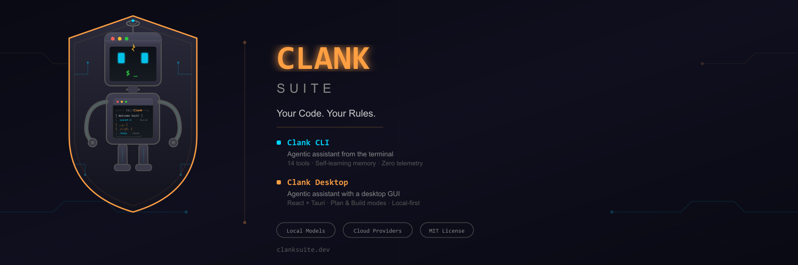

<p align="center">
  
</p>

# Clank — CLI & Desktop

> Agentic assistant — terminal and GUI — powered by local models and cloud providers. **v2.5.21**

Clank is an agentic assistant available as a standalone terminal app (CLI) and a desktop GUI. Both versions share the same engine, config, memory, and sessions. It uses a ReAct-style agent loop with 14 built-in tools to reason, act, and iterate — reading files, writing code, running commands, searching your codebase, fetching the web, and more. Connect it to local models (Ollama, llama.cpp, LM Studio, vLLM) or cloud providers (Claude, Gemini, OpenAI) and point it at a problem.

> **Warning:** Clank can read, write, and delete files, execute shell commands, and modify your system. Review agent actions carefully. We recommend using MEDIUM or HIGH safety levels.

---

## Install

### Windows

```powershell
irm https://raw.githubusercontent.com/ItsTrag1c/Clank/cli/install.ps1 | iex
```

Run this in PowerShell to download and install the latest release. Open a new terminal and type `clank`.

### macOS

**Homebrew (recommended):**
```bash
brew install clankai/clank/clank
```

**Manual install** — download the `Clank` binary from the latest release:
```bash
chmod +x Clank
sudo mv Clank /usr/local/bin/clank
```

---

## Download

**[→ Latest Release](https://github.com/ItsTrag1c/Clank/releases/latest)**

| File | Platform | Description |
|------|----------|-------------|
| `Clank_x.y.z_setup.exe` | Windows | Installer — installs to Program Files, adds `clank` to PATH |
| `Clank_x.y.z.exe` | Windows | Standalone EXE — run anywhere, no admin rights needed |
| `Clank` | macOS | Standalone binary (Apple Silicon) |
| `SHA256SUMS.txt` | — | SHA-256 checksums for verification |

---

## Desktop App

The desktop version provides the same agentic engine in a windowed interface. Available on Windows and macOS, same as the CLI.

**[→ Latest Desktop Release](https://github.com/ItsTrag1c/Clank/releases/latest)**

| File | Description |
|------|-------------|
| `Clank Desktop_x.y.z_x64-setup.exe` | Windows installer |
| `Clank Desktop_x.y.z_aarch64.dmg` | macOS Apple Silicon |
| `Clank Desktop_x.y.z_x64_en-US.msi` | Windows MSI |

---

## Features

- **ReAct agent loop** — iterative reason-and-act cycle with streaming + tool calling
- **3 agent modes** — Build (full agent), Plan (read-only exploration), Q&A (web search + conversation)
- **14 built-in tools** — read_file, write_file, edit_file, list_directory, search_files, glob_files, bash, git, web_fetch, web_search, npm_install, pip_install, install_tool, generate_file
- **Local models & cloud providers** — Ollama, llama.cpp, LM Studio, vLLM, Claude, Gemini, OpenAI, and any OpenAI-compatible backend
- **Local model optimizations** — auto-detects context window size, adaptive result truncation, compact system prompts, tiered tool sets, memory budgeting, and earlier compaction — reducing context overhead by 50-80% for local LLMs. Configurable via `localOptimizations` in config; cloud models unaffected.
- **Native tool-calling** — each provider uses its own tool-call protocol; XML fallback for models without native support
- **Multi-server support** — connect to multiple local servers simultaneously; models auto-discovered and routed
- **Persistent memory** — global + topic-based memory files, plus per-project `.clank.md`
- **3-tier safety system** — tools classified as Low, Medium, or High risk with confirmation prompts
- **PIN protection** — optional, PBKDF2-hashed; API keys encrypted at rest (AES-256-GCM); `CLANK_PIN` env var for headless/CI usage
- **Hardened tool execution** — spawnSync with argument arrays for all shell calls (no string interpolation), HTML sanitization in generate-file, comprehensive destructive command blocking, regex safety limits in search-files
- **Session tracking** — `/undo` to restore last file change, `/diff` to see all changes

---

## Usage

```
clank [options]
```

| Flag | Description |
|------|-------------|
| `-v, --version` | Print version and exit |
| `-h, --help` | Print help and exit |
| `-m, --model <name>` | Use a specific model for this session |
| `-c, --continue` | Resume last conversation |
| `--compact` | Reduced output (no thinking indicators) |
| `--no-memory` | Disable memory injection for this session |
| `--no-banner` | Skip the banner |
| `--trust` | Auto-approve all tool confirmations |
| `--telegram` | Start the Telegram bot (requires token, see `/telegram`) |
| `--pin <pin>` | Provide PIN for headless modes (e.g., `--telegram`) |

---

## Slash Commands

| Command | Description |
|---------|-------------|
| `/help` | Full command reference |
| `/model [name]` | Show or switch model |
| `/models` | List available models |
| `/mode [build\|plan\|qa]` | Toggle or set agent mode |
| `/agent rename <name>` | Rename the agent |
| `/session` | Browse and resume past sessions |
| `/memory` | Manage memories |
| `/instructions` | Show project agent instructions |
| `/tools` | List available tools |
| `/context` | Show context usage |
| `/activity` | Show session file changes |
| `/settings` | Show current config |
| `/clear` | Clear conversation |
| `/undo` | Undo last file change |
| `/diff` | Show all session changes |
| `/compact` | Toggle compact output |
| `/trust` | Toggle auto-approve for session |
| `/reflect` | Review session and extract lessons |
| `/home` | Redisplay the dashboard |
| `/telegram` | Manage Telegram bot settings |
| `/update` | Pull latest & rebuild from GitHub |
| `/quit` | Exit |

---

## Telegram Bot

Chat with the Build agent from your phone via Telegram. The agent runs locally — Telegram is just the I/O layer.

1. Get a bot token from [@BotFather](https://t.me/BotFather) on Telegram
2. Set the token: `/telegram token <token>` (in the CLI) or via Desktop Settings
3. Generate an access code: `/telegram code`
4. Start the bot: `clank --telegram`
5. Send the access code to the bot on Telegram to authenticate

### Telegram Commands

| Command | Description |
|---------|-------------|
| `/start` | Welcome message and command list |
| `/new` | Start a fresh session |
| `/clear` | Clear conversation history |
| `/sessions` | List recent sessions (tap to load or delete) |
| `/clearsessions` | Delete all sessions |
| `/mode` | Switch between Build / Plan / Q&A |
| `/model [name]` | Show or set model |
| `/models` | List all available models |
| `/status` | Show agent status |
| `/trust` | Toggle auto-approve |
| `/cancel` | Cancel current operation |

See the [Telegram Setup Guide](https://github.com/ItsTrag1c/Clank/wiki/Telegram-Setup) for detailed instructions.

---

## Privacy

All data is stored locally on your device (`%APPDATA%\Clank\` on Windows, `~/.clank/` on macOS). When a PIN is set, API keys are encrypted at rest using AES-256-GCM. Nothing is collected, tracked, or synced to any server.

See our [Privacy Policy](https://clanksuite.dev/privacy) for full details.

---

## Community

- [X (@ClankSuite)](https://x.com/ClankSuite)
- [Reddit (r/ClankSuite)](https://reddit.com/r/ClankSuite)
- [GitHub](https://github.com/ItsTrag1c/Clank)

## License

[MIT](LICENSE)

Part of the [Clank Suite](https://clanksuite.dev) — Created by [ItsTrag1c](https://github.com/ItsTrag1c).
